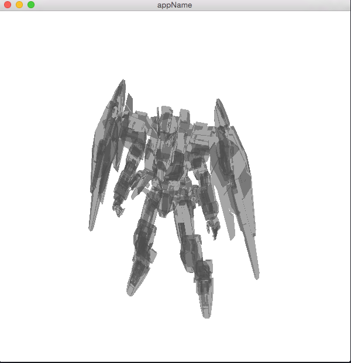
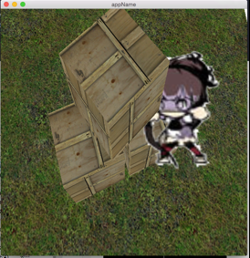

## lua2d
An 3d game engine with full lua binding, but it is still in a very eraly stage.

It use [cppgl](https://github.com/iichenbf/cppgl) to deal with OpenGL; Nodes are organized by levels, like Director->Scene->Layer->Sprite; We support 2D ImageSprite, MeshSprite now.

####It just works:



####Demo:
[I want to see the file.](https://github.com/iichenbf/lua2d/blob/master/lua2d_glfw/lua2d_glfw/main.cpp)

```c++
static void lua2d_demo()
{
    auto& director = l2d::Director::getInstance();
    director.init(600, 600, "appName");

    auto scene = l2d::Scene::create();
    auto layer = l2d::Layer::create();
    auto arrow = l2d::ImageSprite::create("shooting_arrow.png",71, 98);
    arrow->load();

    auto cube = l2d::MeshSprite::create("cube.obj", "cube.png");
    cube->load();
    auto gaoda = l2d::MeshSprite::create("gaoda.obj", "gaoda.jpg");
    gaoda->load();

    auto tank = l2d::MeshSprite::create("tank.obj", "tank.jpg");
    tank->load();
    arrow->setX(0.5f);
    arrow->scale(1.5f);
    arrow->rotate(-45.0f);
    arrow->setZ(0.5f);
    cube->scale(1.2f);

    layer->addSprite(cube);
    layer->addSprite(arrow);
    layer->addSprite(gaoda);
    layer->addSprite(tank);
    gaoda->setY(-20.0f);

    scene->addLayer(layer, 0);
    director.runWithScene(scene);
    director.setProj(glm::radians(45.0f), 800.0f/600.0f, 1.0f, 100000.0f);
    director.lookAt(glm::vec3(23.1f,80.0f,90.2f), glm::vec3(0.1f,0.1f, 0.0f), glm::vec3(0.0f,1.0f,0.0f));
    director.mainLoop();
}

```

####Changes:

20150512 mesh is supported.

####Todo:
there are many things should be done...
